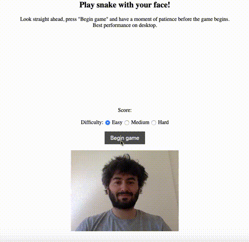

# Ai Motion Capture

Keyboards are for losers -- play snake by moving your head! 

## How does this work?

I use the tensorflow.js model to estimate the head pose in real time using the device's camera. When the game starts, the direction in which the head is pointing is estimated as a reference point. Subsequent estimates during game play are compared to this to decide which direction to steer the snake.

The head direction is estimated by calculating the vectors connecting
the centre of the lips to the left and right cheeks. These two vectors lie
on a plane that approximates the surface of the face. The cross product of these
vectors is normal to this plane and thus points approximately in the direction
of the head.

## Demo 

You can test this here: <a href="https://sadman-shahriar.github.io/ai-motion-capture/">Try a Demo</a>
